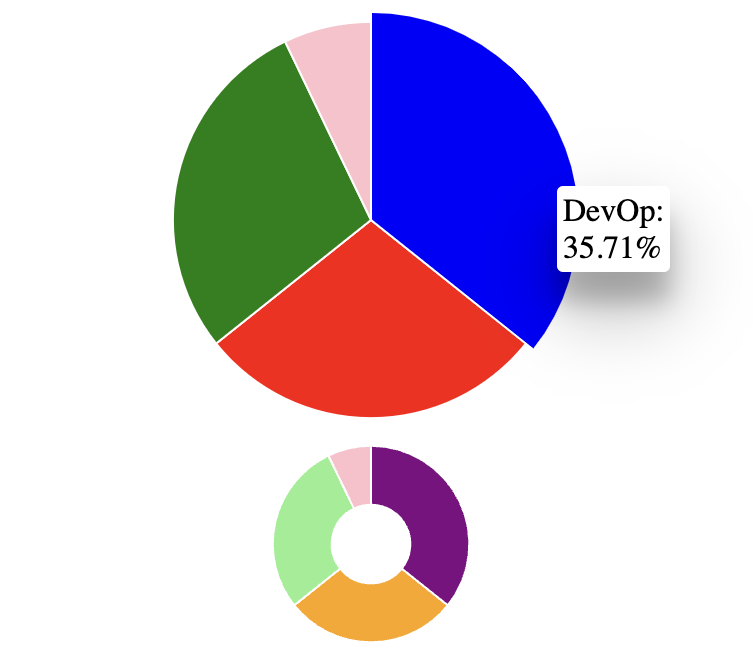

## Overview
<p align="center">
  
</p>

This library generates a responsive pie chart based on the data you provide. When hovered over and clicked on, an context menu which displays data details will show while the corresponding pie segment highlighted. The size and shape of the chart as well as segment colors and labels can be customized. Perticularly, two types of pie chart (classic pie chart and donut chart) can be generated based on the donut hole value provided by user. This library was generated with [Angular CLI](https://github.com/angular/angular-cli) version 14.2.0. 

A visual demo of the pie chart can be found [here](https://angular-ivy-ggl4uo.stackblitz.io). You are welcomed to play with it.

<br></br>

## Usage
Step 1: Install the library to your project by `npm i responsive-pie-chart`.  
Step 2: Import **ResponsivePieChartModule** to your module.  
Step 3: Use the library in your html file as shown below. The *data* property is mandatary while all the other three properties are optional. The default values for *width* and *height* is 100. The default value for *donutHole* is 0 which means it's a classic pie chart rather than a donut chart.
```
<lib-responsive-pie-chart
    [data]="data"
    [width]="300"
    [height]="300"
    [donutHole]="30"
></lib-responsive-pie-chart>
  ```
<br></br>
## Example of Input Data Structure
```
export interface Data {
  name: string; 
  value: number;
  color: string;
}

data: Data[] = [
    {
      name: 'IT',
      value: 4,
      color: 'orange',
    },
    {
      name: 'DevOp',
      value: 5,
      color: 'blue',
    },
    {
      name: 'UI',
      value: 4,
      color: 'green',
    }
];
```
<br></br>
## Live Coding Demo
[https://stackblitz.com/edit/angular-ivy-ggl4uo?file=src%2Fapp%2Fapp.component.html](https://stackblitz.com/edit/angular-ivy-ggl4uo?file=src%2Fapp%2Fapp.component.html)
<br></br>
## Dependencies
"@angular/common": "^14.2.0",</br>
"@angular/core": "^14.2.0",</br>
"@types/d3": "^7.4.0",</br>
"d3": "^7.6.1"</br>


